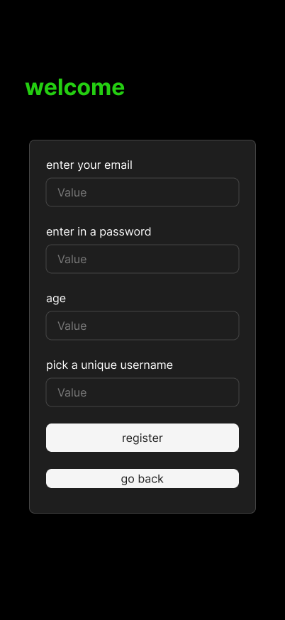

# Account Creation



## Purpose
This screen allows new users to register a **gotLocks** account locally.  
It captures minimal input — email, password, age, and a unique username that becomes their permanent in-app identity.  
The username the user picks here (or during Google onboarding) is the canonical display name that shows up in groups, chat, leaderboards, and feeds.  
The form simulates onboarding logic before the real backend (Supabase) is connected.

---

## User Flow
**Comes from:** Landing Page → “Create an account”  
**Next:** On success → **Intro Text** screen  

**Alternative path:**  
- `Go Back` → returns user to **Landing Page**  
- Google sign-in users who return from OAuth but lack a username land on this same form (with email pre-filled) to complete the **Set Username** step.

---

## Core Elements
- **Header:** “welcome” — green accent (`COLORS.ACCENT`)  
- **Form Fields:**  
  - `enter your email`  
  - `enter in a password`  
  - `age` (numeric input, optional validation ≥18)  
  - `pick a unique username`  (cannot be changed later, checks against all registered usernames to make sure no duplicates exist; this value feeds `User.name` everywhere)
- **Primary Button:** `register` — submits and creates mock user  
- **Secondary Button:** `go back` — returns to Landing Page  

---

## Interactions & States
- Typing in inputs updates local `formData` state.  
- `register` button validates all fields:
  - Required: email, password, username  
  - Optional: age (can skip)  
- If validation passes:
  ```ts
  mockUsers.push({
    id: "u8",
    name: formData.username,
    email: formData.email,
  })
  setUser(mockUsers.find(u => u.id === "u8"))
  navigate("/intro-text")

If validation fails → show small red inline error (COLORS.ERROR).

Button disables during submission simulation (e.g., isLoading = true).

Behavioral Rules

Must not allow duplicate usernames (simple check: mockUsers.some(u => u.name === formData.username)).

For Codex mock version:

No backend calls, no encryption, no real auth.

Simulate registration purely in React state.

Password input should toggle between text and obscured view.

go back button navigates back to /landing-page.

Mock Data Simulation

Successful registration adds user to mockUsers in /lib/mockData.ts.

Temporary session stored in useState or global store (useUserStore).

Username “Shane” (mockUsers[0]) already exists → should trigger “username taken” message.

On valid submission → app transitions to Intro Text screen, maintaining session context.

Codex Notes

Framework: Next.js + TypeScript + Tailwind

Style: centered card form, dark background, white input boxes, rounded corners

Layout: vertically stacked form inside a dark card with soft border-radius (rounded-2xl)

Text hierarchy: header (bold, accent green), labels (gray), button text (white)

Validation UX: error text in red, subtle vibration or shake optional

Mobile-first: single-column layout, scroll-safe padding

No backend imports: mock local registration only

Navigation:

On register → /intro-text

On go back → /landing-page

Connected Docs
Area	Reference
Theme & Palette	/docs/theme-guidelines.md
App Flow	/docs/app-overview.md
Logic Rules	/docs/logic/game-logic.md
Mock Data	/lib/mockData.ts
Constants	/lib/constants.ts

## Data Behavior
Writes to:
- `mockUsers[]` — adds a new user object when registration is successful.
