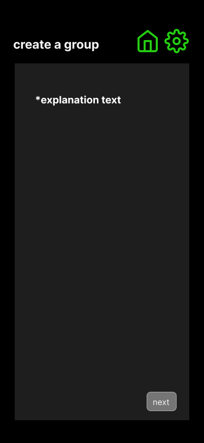

# Create a Group — Explained

## Purpose
This screen explains what happens when a user creates a new group in **gotLocks** — defining the commissioner role, how slips work, and what members can expect before moving to the setup form.  
It’s scrollable for easy reading on mobile and serves as a built-in rules overview for new group leaders.

---

## User Flow
**Comes from:** Home → “Create a Group”  
**Next:** Tap **next** → navigates to `/cag-form` (group creation form)  
**Back:** Tap home icon → returns to Home screen  

---

## Core Content (User-Facing Copy)

You’re about to start a new group in gotLocks — that makes you the commissioner.

In every group, there are two roles:
• Commissioner — the leader who sets it all up, chooses the sport, names the group, controls deadlines, verifies results, and ultimately approves points awarded.
• Members — everyone who joins with your invite code and makes their weekly picks.

How it works
• Your group competes on a running leaderboard by making picks on recurring “slips.”
• Each slip has two key dates:
– Pick deadline: when all members must lock in their picks.
– Results deadline: when you (the commissioner) finalize the outcomes for that slip.
- Both these deadlines can be changed later if needed
• After the results deadline, the slip is final — points lock in, the board updates, and a new slip opens automatically.

Scoring System
Each pick earns or loses points based on its odds range:

Odds Range	Points for Win	Points for Loss
–250 or shorter	+5 pts	–10 pts
–249 to 0	+10 pts	–10 pts
+1 to +250	+15 pts	–10 pts
+251 to +500	+20 pts	–10 pts
+501 and up	+25 pts	–10 pts

Additionally, Commissioners can award manual bonuses for streaks or perfect slips before the results deadline.

Fairness & Late Joins
• Anyone with your invite code can join your group anytime.
• If someone joins after a slip’s pick deadline, they’ll start fresh on the next slip.
• Commissioners can give bonus points or adjustments to keep things fair.

Voids & Missed Deadlines
• If a results deadline passes without being finalized, that entire slip is marked void and gives zero points to everyone.
• The next slip will still open on schedule — so your group keeps rolling.

Your Role as Commissioner
• Name your group and select the sport.
• gotLocks is built for any sport, but the default setup is NFL Sundays.
• For other sports, just pick one from the dropdown — then set your own deadlines.
• You can customize each slip’s name (like “Week 3: Rivalry Week”) and manage overrides or bonuses before results deadline.
• You’ll get a unique invite code to share — that’s how members join.

What Members See
• On their home screen, members paste your invite code into “Join a Group.”
• Once they’re in, they can submit picks, see slip statuses (open / locked / final / voided), and follow the leaderboard each week.

📘 You can revisit this explanation anytime under Settings → Rules & Scoring.

---

## Layout & Styling
- Scrollable card or vertical container on dark background  
- White text, accent green (`COLORS.ACCENT`) for emphasis on roles and key terms  
- Section headers bold and spaced out for readability  
- Bottom-right **next** button (gray or green, rounded-2xl)  

---

## Behavioral Rules
- Tap **next** → navigates to `/cag-form`  
- Back/home icons → return to Home  
- Informational only — no data input  
- Scrollable on small viewports  

---

## Connected Docs
| Area | Reference |
|------|------------|
| App Flow | `/docs/app-overview.md` |
| Logic Rules | `/docs/logic/game-logic.md` |
| Theme | `/docs/theme-guidelines.md` |
| Constants | `/lib/constants.ts` |
