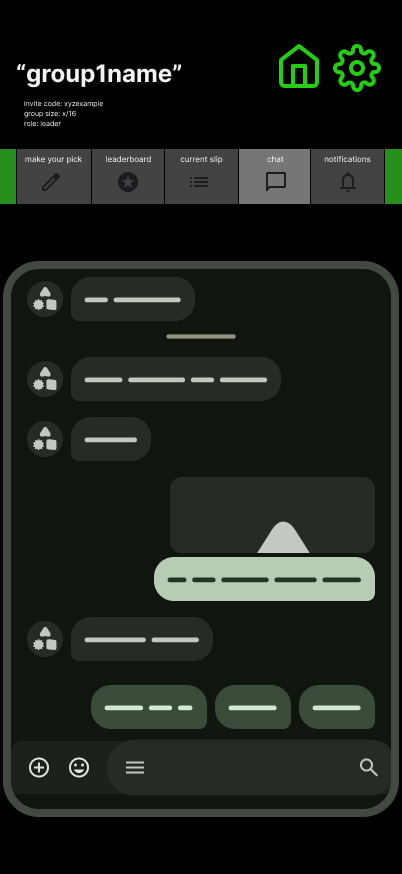

# Group — Chat



## 🧩 Purpose
A simple, text-only chat for group members to talk, joke, and react throughout each contest.  
No message editing, deleting, or media — just clean, quick conversation.  
All messages stored in mock state for MVP.

---

## 🧭 Entry & Flow

**Comes from:**  
Group Hub → Top Tab → *Chat*

**Next:**  
Users can send messages or emojis, scroll through chat history, and see messages from all group members in order.

---

## 💬 Layout Overview

| Section | Description |
|----------|-------------|
| **Message List** | Scrollable list of all messages. |
| **Input Bar** | Fixed at bottom; includes text input and emoji button. |

---

## 🧱 Message Object

```ts
{
  id: string
  group_id: string
  sender_id: string
  text: string
  type: "text" | "emoji"
  created_at: string
}
````

---

## 🧑‍🤝‍🧑 Roles & Permissions

| Role             | Permissions                                   |
| ---------------- | --------------------------------------------- |
| **All Members**  | Can send text or emoji messages.              |
| **Commissioner** | Same permissions; no moderation tools in MVP. |

No message editing, deleting, or system posts.
All system-related events (like slip changes or bonuses) appear only in **Feed**, not Chat.

---

## 🔄 Behavior

* Type in the input bar → press “Send” or Enter.
* Message instantly appears at the bottom.
* Chat scrolls automatically to latest message.
* Older messages remain visible indefinitely.
* All messages persist in mock state (`mockChat`).

Example mock data:

```ts
export const mockChat = [
  { id: "c1", group_id: "sunday-locks", sender_id: "u1", text: "Jets by 30 😤", type: "text", created_at: "2025-10-17T20:15:00Z" },
  { id: "c2", group_id: "sunday-locks", sender_id: "u3", text: "😂😂😂", type: "emoji", created_at: "2025-10-17T20:16:00Z" },
  { id: "c3", group_id: "sunday-locks", sender_id: "u5", text: "wait fr tho 👀", type: "text", created_at: "2025-10-17T20:17:00Z" }
]
```

---

## 🎨 UI / UX Notes

* **Background:** dark gradient (`COLORS.DARK_BG`)
* **Bubbles:**

  * Current user → accent green background
  * Others → muted gray
* **Rounded corners:** high radius (`rounded-2xl`)
* **Timestamps:** optional subtle gray beneath each message
* **Scroll:** smooth auto-scroll to latest
* **Empty State:**

  > “No messages yet — start the chat!”

---

## 🧩 Codex Implementation Notes

* Local mock-only state (no backend).
* `useState` or lightweight store to hold messages.
* Input bar fixed to bottom of safe viewport.
* “Send” triggers simple `mockChat.push()` logic.
* No edit/delete handlers, no moderation controls.
* No typing indicators or media upload.
* Only text + emoji support.

---

## 🔗 Connected Docs

| Area            | Reference                     |
| --------------- | ----------------------------- |
| Group Hub       | `/docs/screens/group-card.md` |
| Feed            | `/docs/screens/group-feed.md` |
| Mock Data       | `/lib/mockData.ts`            |
| Theme & Palette | `/docs/theme-guidelines.md`   |

---

**Last Updated:** October 2025
