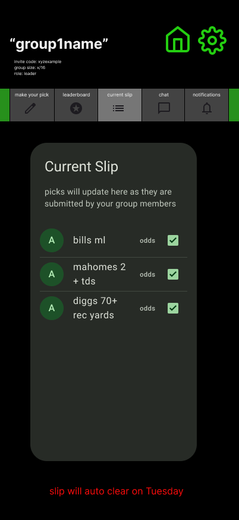

# Group — Current Slip

## 🧩 Purpose
Displays all member picks for the **active slip** in a group.  
Updates dynamically as members submit or resubmit picks before the pick deadline, and transitions into read-only view once locked.  
This screen functions as a transparent scoreboard-in-progress for the current week or contest round.

---

## 🧭 Entry & Flow

**Comes from:**  
Group Hub → Top Tab → *Current Slip*

**Next:**  
- Auto-refreshes as new picks are submitted.  
- Transitions to “locked” view after pick deadline.  
- Auto-clears and rolls into new slip after results deadline passes.

---

## 📊 Live Content

**Header:** “Current Slip”  
**Subtext:** “Picks will update here as they are submitted by your group members.”

Each list item shows:

| Element | Description |
|----------|-------------|
| **Avatar / Initial** | First letter of username |
| **Username** | From `mockUsers` |
| **Pick Description** | From `mockPicks.description` |
| **Odds Range Label** | From `mockPicks.odds_bracket` |
| **Checkmark Icon** | Indicates submission complete |

If a user hasn’t submitted yet:
> Display a faded “— waiting for pick —” placeholder under their name.

---

## 🔄 Behavior by Slip State

| Slip Status | Behavior | Visual |
|--------------|-----------|--------|
| **Open** | Live-updating list. Members can resubmit until pick deadline. | Green check icons show submitted picks. |
| **Locked** | Form disabled in “Make Your Pick.” Picks frozen in display. | Header adds note: “Picks locked. Awaiting results.” |
| **Finalized** | Replaced with finalized slip in leaderboard view. | Background tinted darker gray; header reads “Finalized Slip.” |
| **Voided** | Slip shows all zeros in leaderboard. | Red “VOIDED” label at top. |

---

## 🧠 Auto-Transitions

- **Pick Deadline (default Sunday 12:00 AM):**
  → locks all pick submissions.
- **Results Deadline (default Tuesday 11:59 PM):**
  → clears slip and auto-opens new one.
  - Banner:  
    > “Slip will auto clear on Tuesday.”

New slip index increments (e.g., Slip 1 → Slip 2).

---

## 🧑‍💼 Commissioner Controls

Visible only for `role: leader`:

| Control | Function |
|----------|-----------|
| **Override Pick** | Edits or replaces a user’s pick before results deadline. |
| **Mark Result** | Assigns Win / Loss to each pick after game day. |
| **Apply Bonus/Penalty** | Manual +/– point adjustment. |
| **Force Finalize Slip** | Ends slip early if all results entered. |
| **Void Slip** | Marks slip as void (zero points). |

All actions logged in Activity Feed with timestamp and tag (e.g., `override`, `bonus`, `void`).

---

## 🧾 Data Sources

| Data | Source | Description |
|------|---------|-------------|
| Active Slip | `mockSlips.find(s => s.status === "open")` | Current slip reference |
| Picks | `mockPicks.filter(p => p.slip_id === activeSlip.id)` | Member submissions |
| Users | `mockUsers` | For names and avatars |
| Leaderboard | `mockLeaderboard` | For cumulative points display in header |

---

## 🎨 UI / UX Notes

- **Layout:** single-column vertical list with rounded cards.  
- **Background:** dark gray (`COLORS.CARD_BG`).  
- **Active Picks:** bright green checkmark icon (`COLORS.ACCENT`).  
- **Empty State:**  
  > “No picks yet. As your group submits, they’ll appear here.”  
- **Deadline Banner:** red italic text at bottom (“Slip will auto clear on Tuesday”).  
- **Transitions:** fade-in new rows when new picks appear.  

---

## ⚠️ Edge Cases

- New member joins mid-slip → shows “— waiting for pick —” until they submit.  
- If a user resubmits, only latest pick shown.  
- Voided slip = archived under Historical Leaderboards (zero points).  
- Slip auto-opens even if previous one voided (keeps weekly cadence).

---

## 🔗 Connected Docs

| Area | Reference |
|------|------------|
| Group Hub | `/docs/screens/group-card.md` |
| Picks Form | `/docs/screens/group-picks.md` |
| Leaderboard | `/docs/screens/group-leaderboard.md` |
| Logic Rules | `/docs/logic/game-logic.md` |
| Mock Data | `/lib/mockData.ts` |

---

**Last Updated:** October 2025