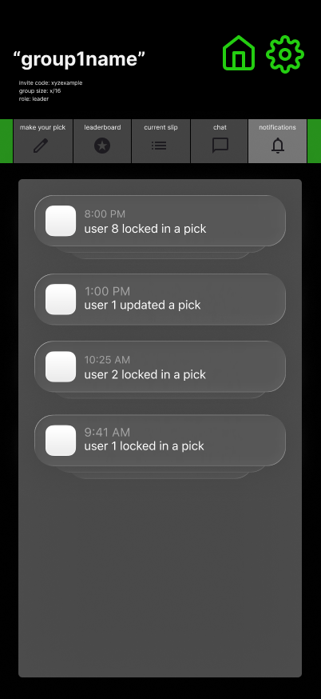

# Group — Feed / Notifications



## 🧩 Purpose
Displays all **activity events** that happen inside the group —  
pick submissions, updates, results, overrides, and voided slips.  
This tab acts as a transparent log for every action that affects the leaderboard.

---

## 🧭 Entry & Flow

**Comes from:**  
Group Hub → Top Tab → *Feed / Notifications*

**Next:**  
View chronological list of group actions (newest first).  
No user input; purely read-only for all members.

---

## 🧱 Feed Object

Each event is represented as:

```ts
{
  id: string
  group_id: string
  actor_id: string | "system"
  action: "pick_created" | "pick_updated" | "pick_deleted" | "status_change" | "result_override" | "bonus_assigned" | "user_joined"
  meta?: Record<string, any>
  created_at: string
}
````

---

## 🧑‍🤝‍🧑 Roles & Visibility

| Role             | Access                                                                     |
| ---------------- | -------------------------------------------------------------------------- |
| **All Members**  | See full group history (picks, results, overrides, joins, voids).          |
| **Commissioner** | Same as members; can trigger manual overrides or bonuses that appear here. |

Everyone’s feed looks identical for transparency.

---

## 🔄 Behavior

* Events sorted by **newest first** (reverse chronological).
* Each event shows:

  * **Timestamp** (local time, 12-hour format)
  * **Actor** (username or “System”)
  * **Action text** (human-readable event summary)

Example event mapping:

| Action            | Display Text                           |
| ----------------- | -------------------------------------- |
| `pick_created`    | “Shane locked in a pick.”              |
| `pick_updated`    | “Marcus updated a pick.”               |
| `status_change`   | “Slip 3 finalized — results posted.”   |
| `result_override` | “Commissioner adjusted Evan’s result.” |
| `bonus_assigned`  | “+5 bonus applied to Nina.”            |
| `user_joined`     | “Talia joined the group.”              |
| `system_voided`   | “Slip 2 voided — no points awarded.”   |

Example mock data:

```ts
export const mockActivityFeed = [
  { id: "a1", group_id: "sunday-locks", actor_id: "u8", action: "pick_created", meta: { description: "Bills ML" }, created_at: "2025-10-18T20:00:00Z" },
  { id: "a2", group_id: "sunday-locks", actor_id: "u1", action: "pick_updated", meta: { description: "Mahomes 2+ TDs" }, created_at: "2025-10-18T17:00:00Z" },
  { id: "a3", group_id: "sunday-locks", actor_id: "u2", action: "pick_created", meta: { description: "Diggs 70+ yards" }, created_at: "2025-10-18T14:25:00Z" },
  { id: "a4", group_id: "sunday-locks", actor_id: "system", action: "status_change", meta: { slip_id: "slip2", new_status: "finalized" }, created_at: "2025-10-14T04:00:00Z" }
]
```

---

## 🎨 UI / UX Notes

* **Layout:** simple stacked cards (like notification bubbles).
* **Order:** newest at top, auto-scrolls down.
* **Bubble Style:**

  * Light gray rounded box (`rounded-2xl`, `bg-surface`)
  * Accent strip or glow if event is “system” or “commissioner”
* **Text Layout:**

  * Timestamp (smaller, gray, top-left)
  * Message (primary text, white)
* **Empty State:**

  > “No activity yet — picks will appear here as soon as they’re made.”

---

## 🧩 Codex Implementation Notes

* Local mock-only array (`mockActivityFeed`).
* Render using `.map()` with timestamp formatting.
* No pagination, no filters for MVP.
* System and user events share the same structure.
* Scrollable container with padding bottom for mobile safe area.

---

## 🔗 Connected Docs

| Area            | Reference                            |
| --------------- | ------------------------------------ |
| Group Hub       | `/docs/screens/group-card.md`        |
| Picks           | `/docs/screens/group-picks.md`       |
| Leaderboard     | `/docs/screens/group-leaderboard.md` |
| Mock Data       | `/lib/mockData.ts`                   |
| Theme & Palette | `/docs/theme-guidelines.md`          |

---

**Last Updated:** October 2025
