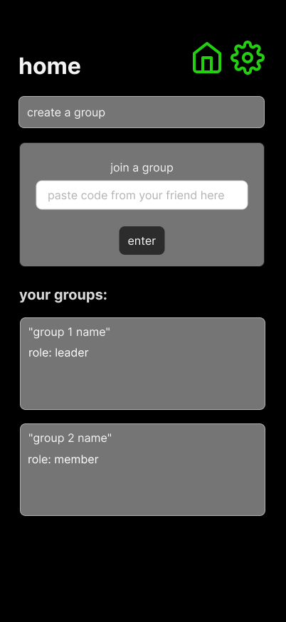

# Home



## Purpose
This is the user’s main dashboard after completing onboarding.  
It acts as the control hub — letting users create or join groups and view all groups they belong to.  

---

## User Flow
**Comes from:** Intro Text → “Get Started”  
**Next:**  
- **Create a Group** → navigates to `/cag-explained` (Create-A-Group flow)  
- **Join a Group** → validates code input → navigates to that group’s dashboard (e.g. `/group/[id]`)  
- **Select a Group Card** → opens that group’s detail view (default: `/leaderboard`)  

---

## Core Elements
- **Header:** “home” (white, bold)  
- **Icons (top right):**  
  - 🏠 → current page indicator (green when active)  
  - ⚙️ → link to Settings screen  

- **Create a Group Button:**  
  - Label: `create a group`  
  - Full-width button, rounded-2xl, green hover accent  
  - On press: navigates to `/cag-explained`  

- **Join a Group Section:**  
  - Gray rounded card container  
  - Label: `join a group`  
  - Input field placeholder: “paste code from your friend here” 
  - Submit button: `enter` (dark gray, white text)  
  - On submit: 
    - Validates numeric invite code  
    - If match found in `mockGroups.invite_code`, adds user to `members` array  
    - If invalid → shows inline red error message  

- **Your Groups Section:**  
  - Title: `your groups:`  
  - Dynamically renders group cards based on membership in `mockData.groups`  
  - Each card displays:  
    - Group name  
    - User role (leader / member)  
  - On press → navigates into group dashboard (default tab: `leaderboard`)  

---

## Behavioral Rules
- **Join Validation:**  
  ```ts
  const group = mockGroups.find(g => g.invite_code === inputCode)
  if (group) {
    group.members.push(currentUser.id)
  } else {
    setError("Invalid code")
  }

Role Assignment:

If created_by === currentUser.id → role = “leader”

Else → role = “member”

Groups Display: sorted by role (leader first, then member)

Duplicate Join Protection: if already a member, block re-entry

Layout & Styling

Background: black

Containers: gray (#3a3a3a) with soft rounded corners

Buttons: green (COLORS.ACCENT) or dark gray (COLORS.BUTTON)

Text: white

Font weight: semi-bold for section titles

State & Mock Data

Pulls user + groups data from /lib/mockData.ts

When user joins, state updates locally (simulate “add member”)

Persist state in memory only (no backend sync)

Connected Docs
Area	Reference
Theme & Palette	/docs/theme-guidelines.md
App Flow	/docs/app-overview.md
Logic Rules	/docs/logic/game-logic.md
Mock Data	/lib/mockData.ts
Constants	/lib/constants.ts

