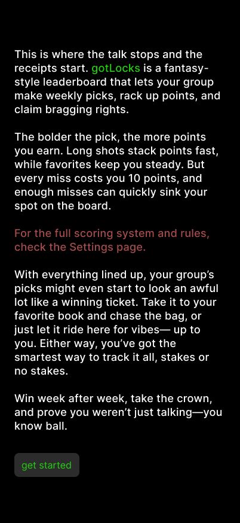

# Intro Text

## Purpose
This screen introduces **gotLocks** after a successful account creation.  
It gives new users a quick, motivating overview of how the leaderboard system works — emphasizing competition, points, and bragging rights — before dropping them into the main app.

---

## User Flow
**Comes from:** Account Creation  
**Next:** Tap **Get Started** → navigates to **Home**

---

## Core Content
This is where the talk stops and the receipts start. gotLocks is a fantasy-style leaderboard that lets your group make weekly picks, rack up points, and claim bragging rights.

The bolder the pick, the more points you earn. Long shots stack points fast, while favorites keep you steady. But every miss costs you 10 points, and enough misses can quickly sink your spot on the board.

For the full scoring system and rules, check the Settings page.

With everything lined up, your group’s picks might even start to look an awful lot like a winning ticket. Take it to your favorite book and chase the bag, or just let it ride here for vibes—up to you. Either way, you’ve got the smartest way to track it all, stakes or no stakes.

Win week after week, take the crown, and prove you weren’t just talking—you know ball.

---

## Layout & Styling
- Background: black  
- Text: white; `gotLocks` in neon green (`COLORS.ACCENT`)  
- “For the full scoring system and rules…” in muted red (`COLORS.SECONDARY`)  
- Button: green (`COLORS.ACCENT`), label `get started`, rounded corners  

---

## Behavior
- `get started` → transitions to `/home`
- Persistent user session from registration  
- One-time onboarding (simulate with `hasSeenIntro` boolean)  

---

## Connected Docs
| Area | Reference |
|------|------------|
| Theme & Palette | `/docs/theme-guidelines.md` |
| App Flow | `/docs/app-overview.md` |
| Mock Data | `/lib/mockData.ts` |
| Constants | `/lib/constants.ts` |
