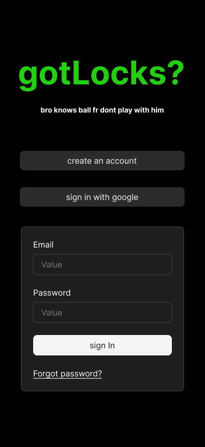

# Landing Page



## Purpose
This is the first touchpoint for **gotLocks**, introducing users to the app’s identity and onboarding flow.  
Its goal: clearly communicate the brand energy (“bro knows ball”), provide quick sign-in options,  
and guide new users smoothly into the **Account Creation** or **Intro Text** experience.

---

## User Flow
**Comes from:** external link, app open, or shared invite  
**Next:**  
- `Create Account` → goes to **Account Creation** screen  
- `Sign in with Google` → triggers OAuth (handled by Supabase backend in Phase 2)  
- Successful Google auth → if the Supabase profile has no username, route to the **Set Username** onboarding step before continuing  
- Once a username exists, redirect to **Intro Text**  

---

## Core Elements
- **Logo / Header:** `gotlocks?` — large, centered, using accent color from `COLORS.ACCENT`  
  - Tagline beneath: *“bro knows ball”*  
- **Primary CTA (green):** `create an account` → launches registration flow  
- **Secondary CTA (white outline):** `sign in with Google` → initiates OAuth and, on first-time success, funnels the user to pick a unique in-app username  
- **Manual Sign-In Section (optional fallback):**  
  - Email input field  
  - Password input field  
  - White `sign in` button  
  - `Forgot password?` link (inactive placeholder)  

---

## Interactions & States
- All buttons include hover/press feedback (subtle glow or opacity drop).  
- Google Sign-In: triggers OAuth redirect (future backend hook). After Supabase confirms the user, the flow must enforce a **Set Username** gate until a unique username is saved; only then should the user enter the core experience.  
- Manual Sign-In: validates credentials against mock user list →  
  on success, updates local auth state and redirects to **Intro Text**.  
- Error states (wrong email/password): red error text (`COLORS.ERROR`).  
- `Forgot password?`: non-functional placeholder in this frontend build.

---

## Behavioral Rules
- **Only one path active at a time** — if a user chooses “Create Account” or “Google,”  
  manual form hides automatically to avoid confusion.  
- Background remains static dark gradient (`COLORS.BACKGROUND` → `COLORS.SECONDARY`).  
- No backend calls; all inputs simulate success via local `useState` updates.  

---

## Mock Data Simulation
- When a user signs in successfully, `mockUsers[0]` (Shane) becomes the active session.  
- Codex can store session context via React Context or Zustand.  
- Use placeholders like:
  ```ts
  const [user, setUser] = useState(mockUsers[0])
  
Codex Notes

Framework: Next.js + TypeScript + Tailwind (mobile-first layout).

Style: full-screen vertical stack, center-aligned elements, soft drop-shadow buttons.

Spacing: generous top padding (brand), equal vertical spacing for CTAs.

Typography: bold modern sans-serif for title, muted gray subtext.

Accent colors: from /lib/constants.ts → COLORS.ACCENT and COLORS.SECONDARY.

Responsiveness: layout scales down cleanly to iPhone-sized viewports.

No backend imports: only local mock data / UI simulation.

Connected Docs
Area	Reference
Theme & Palette	/docs/theme-guidelines.md
App Flow	/docs/app-overview.md
Mock Users	/lib/mockData.ts
Constants	/lib/constants.ts
