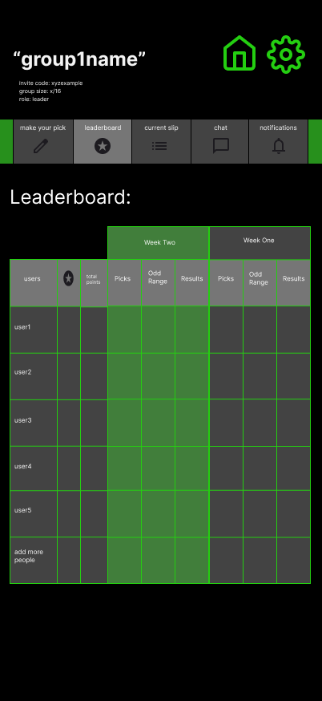

# Group — Leaderboard



## 🧩 Purpose
Displays live and historical standings for all members within a group.  
The leaderboard updates automatically after each slip is finalized and supports horizontal scrolling for older slips.  

---

## 🧭 Entry & Flow
**Comes from:**  
Group Hub → Top Tab → *Leaderboard*

**Next:**  
- Scroll horizontally to view older slips (Slip 1, Slip 2, Slip 3, etc.)  
- Each slip column shows that week’s picks, odds, and results.  
- Cumulative totals update in real time after each slip finalizes.

---

## 🧱 Core Layout

### Fixed Columns (Left Side)
1. **User Avatar / Initial** — from `mockUsers`
2. **Username** — tappable, highlights current user  
3. **Total Points** — running total from `mockLeaderboard.cumulative_points`

These three remain **fixed** as user scrolls horizontally through slips.

---

### Scrollable Columns (Right Side)
Each slip (e.g. “Slip 1,” “Slip 2,” “Slip 3”) occupies a 3-column cluster:

| Column | Label | Description |
|--------|--------|-------------|
| **Pick** | “Picks” | User’s submission for that slip (from `mockPicks.description`) |
| **Odds** | “Odds Range” | Corresponding bracket (e.g., “+1 to +250 → 15 pts”) |
| **Result** | “Results” | Displays ✅ or ❌ plus points awarded or lost |

Example:
```

+15 ✅
-10 ❌

```

---

## 🧠 Display Rules

| Slip Status | Behavior |
|--------------|-----------|
| **Open** | Column visible but dimmed; shows “—” placeholders for results. |
| **Locked (awaiting results)** | Results column grayed out; “Pending” text shown. |
| **Finalized** | All results populated with ✅ or ❌ icons and corresponding point values. |
| **Voided** | Slip header labeled “VOIDED”; all result cells = `0 pts`. |

---

## 🔢 Scoring Recap (for reference)
| Odds Range | Points if Win | Points if Loss |
|-------------|----------------|----------------|
| –250 or shorter | +5 | –10 |
| –249 to 0 | +10 | –10 |
| +1 to +250 | +15 | –10 |
| +251 to +500 | +20 | –10 |
| +501 and up | +25 | –10 |

---

## 🧩 Data Mapping

| UI Element | Source | Notes |
|-------------|---------|-------|
| User Rows | `mockUsers` | one per member |
| Slip Headers | `mockSlips` | dynamic by slip index |
| Pick Data | `mockPicks` | filtered by slip + user |
| Points | `mockLeaderboard` | cumulative & per-slip |

---

## 🧑‍💼 Commissioner-Only Interactions
Commissioners see small edit icons in each finalized slip column:  

| Action | Description |
|---------|--------------|
| **Override Result** | Flip ✅/❌ or adjust points manually (within results deadline). |
| **Apply Bonus / Penalty** | Adds or subtracts custom value. |
| **Rename Slip** | e.g. “Week 3 – Rivalry Week.” |

All edits sync to mock state and log to Activity Feed.

---

## 🎨 UI / UX Notes
- **Table Style:** responsive grid with rounded cell corners and soft dividers.  
- **Fixed Columns:** slight shadow to distinguish from scroll area.  
- **Scrollable Area:** horizontal drag or swipe; smooth inertial scroll.  
- **Header Row:** bold white text; active slip highlighted with accent color (`COLORS.ACCENT`).  
- **Results Icons:**  
  - ✅ green accent  
  - ❌ red accent  
  - “0 pts” gray for voided.  
- **Cumulative Column:** highlighted for easy tracking.  
- **Transitions:** fade-in on slip finalization; pulse animation when totals update.

---

## ⚠️ Edge & State Cases
- **Voided Slip:** shows gray header and zero points.  
- **New Member Mid-Contest:** blank cells for past slips until next slip starts.  
- **No Picks Yet:** placeholder “—” for pick/odds/result cells.  
- **Contest Ended:** table freezes and archives under Historical Leaderboards.

---

## 🧠 Notes for Codex
- Use **CSS grid or flex-scroll hybrid** to maintain fixed first 3 columns.  
- Implement **horizontal scroll sync** between header and body rows.  
- Prioritize **mobile usability** (swipeable, scroll momentum).  
- Keep UI visually elegant — thin dividers, clear hierarchy, readable spacing.

---

## 🔗 Connected Docs

| Area | Reference |
|------|------------|
| Group Hub | `/docs/screens/group-card.md` |
| Current Slip | `/docs/screens/group-slip.md` |
| Mock Data | `/lib/mockData.ts` |
| Logic Rules | `/docs/logic/game-logic.md` |
| Theme & Palette | `/docs/theme-guidelines.md` |

---

**Last Updated:** October 2025