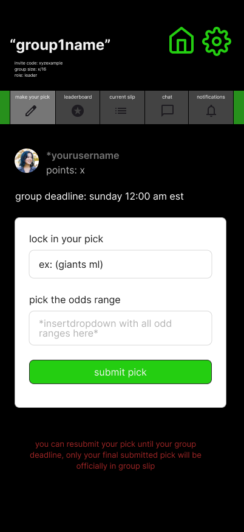

# Group — Make Your Pick



## 🧩 Purpose
This screen allows users to **submit or edit their pick** for the active slip before the group’s pick deadline.  
It connects to the group context defined in `/docs/screens/group-card.md`, pulling slip status, deadlines, and user data from mock state.

---

## 🧭 Entry & Flow

**Comes from:**  
Group Hub → Top Tab → *Make Your Pick*

**Next:**  
- On successful submission → confirmation toast (“Pick submitted!”)  
- Returns to this tab (state updated live)  

---

## 👤 User Context
Displays:

- **Username** (`user.name`)  
- **Points:** live total from leaderboard  
- **Role:** `leader` or `member`  
- **Group Deadline:** `activeSlip.pick_deadline_at` (e.g., “Sunday 12:00 AM EST”)  

---

## 🧱 Core Form Components

| Element | Description | Behavior |
|----------|-------------|-----------|
| **Text Input** | “Lock in your pick” | Freeform text (team, player prop, etc.) |
| **Dropdown** | “Pick the odds range” | Lists all 5 point tiers |
| **Submit Button** | “Submit Pick” | Green accent button, validates + posts mock data |

### Odds Dropdown Options
```

–250 or shorter → 5 pts
–249 to 0 → 10 pts
+1 to +250 → 15 pts
+251 to +500 → 20 pts
+501 and up → 25 pts

````

---

## 🔄 Submission Logic

### On Submit
```ts
mockPicks.push({
  id: generateMockId(),
  slip_id: activeSlip.id,
  user_id: currentUser.id,
  description: pickText,
  odds_bracket: selectedRange,
  result: "pending",
  points: 0,
})
````

* If a previous pick exists for the same user/slip → overwrite it.
* If the pick deadline has passed → disable form and show “Pick window closed.”
* Pick submission only available while `slip.status === "open"`.

### Confirmation

* Green toast: “✅ Pick submitted!”
* Form clears.
* Latest pick shown above form (preview card):

  ```
  Your current pick: Giants ML (+110)
  Odds Bracket: +1 to +250
  ```

---

## 🔁 Editing & Resubmission

Users can **resubmit their pick** any time before the pick deadline.
Only their **final pick before lock** will be shown in the official slip.

Visual cue under form:

> “You can resubmit your pick until your group deadline. Only your final pick will be officially recorded in the slip.”

---

## 🚫 After Deadline

If current time > pick_deadline_at:

* Text and dropdown disabled.
* Button text changes to `Locked`.
* Message displayed:

  > “Picks are locked. See your results after Tuesday’s deadline.”

---

## 🧑‍💼 Commissioner-Specific Behavior

Commissioner can:

* View all members’ picks (before deadline).
* Edit or delete a member’s pick if needed (for typos or errors).
* Add bonus/penalty to user score before results deadline (handled in leaderboard/settings).

Commissioner **cannot** submit picks on behalf of others.

---

## 🧠 State & Data Sources

| Data        | Source                                               | Description              |
| ----------- | ---------------------------------------------------- | ------------------------ |
| Active Slip | `mockSlips.find(s => s.status === "open")`           | Current open slip        |
| User Picks  | `mockPicks.filter(p => p.slip_id === activeSlip.id)` | Filtered per user        |
| Points      | `mockLeaderboard`                                    | Used to show “points: x” |
| Deadlines   | `mockSlips`                                          | Shown dynamically        |

---

## ⚙️ UI / UX Notes

* **Form Layout:** vertically stacked inside card.
* **Submit Button:** full width, bright accent green (`COLORS.ACCENT`).
* **Disabled State:** low opacity, no hover.
* **Typography:** consistent with theme-guidelines.md (muted gray labels, white inputs).
* **Animations:** optional short pulse on submission.
* **Responsiveness:** single-column mobile-first layout.

---

## 🧩 Connected Tabs

| Tab                          | Purpose                                        |
| ---------------------------- | ---------------------------------------------- |
| Leaderboard                  | Displays current and historical totals         |
| Current Slip                 | Shows all submitted picks for the current slip |
| Chat                         | Group message board                            |
| Feed / Notifications         | Pick and result activity                       |
| Settings (Commissioner only) | Group configuration & overrides                |

---

## 🔗 Connected Docs

| Area            | Reference                     |
| --------------- | ----------------------------- |
| Theme & Palette | `/docs/theme-guidelines.md`   |
| Logic Rules     | `/docs/logic/game-logic.md`   |
| Mock Data       | `/lib/mockData.ts`            |
| Group Hub       | `/docs/screens/group-card.md` |

---

**Last Updated:** October 2025

## Data Behavior
Writes to:
- `mockPicks[]` — adds or updates user pick for current slip.
- `mockLeaderboard[]` — recalculates slip and cumulative points after each result.
